# GreenLeaf Master Documentation

## 1. Project Overview

**Project Name:** GreenLeaf - Plant Health AI  
**Project Type:** Final year project / AI-assisted plant disease diagnosis web application  
**Primary Technology:** Python Streamlit  
**Main Application File:** `app.py`

GreenLeaf is a web-based plant health diagnosis system that helps users identify plant species, detect possible leaf disease, and receive treatment guidance. The user uploads a leaf image and enters a city name. The system preprocesses the image, fetches weather information, calls plant identification and disease assessment APIs, performs a basic visible-stress scan, and generates a readable AI diagnostic report.

The system is designed for farmers, gardeners, students, and agriculture support users who need quick plant-health guidance without installing a heavy desktop application.

## 2. Objectives

- Provide a simple web interface for plant leaf image upload.
- Identify plant species from uploaded leaf images.
- Detect likely plant disease or visible stress symptoms.
- Use weather data to improve the usefulness of diagnosis and prevention advice.
- Generate a clear AI-assisted report with cause, treatment, uncertainty, and prevention tips.
- Support multiple common image formats such as JPG, PNG, WebP, BMP, and TIFF.
- Handle low-confidence or failed external API responses with fallback reporting.

## 3. Scope

### In Scope

- Leaf image upload through Streamlit.
- Image normalization and JPEG re-encoding.
- Plant species identification through PlantNet API.
- Disease/health assessment through PlantNet API.
- Weather lookup through OpenWeatherMap.
- AI report generation through Google Gemini.
- Pixel-level fallback symptom scan for visible leaf stress.
- Responsive Streamlit user interface with sidebar instructions.

### Out of Scope

- User login and account management.
- Historical report database.
- Offline disease diagnosis.
- Expert agronomist validation workflow.
- Automatic GPS-based location detection.
- Treatment inventory or pesticide purchase integration.

## 4. Existing Files

| File | Purpose |
| --- | --- |
| `app.py` | Main Streamlit web application. Contains UI, image preprocessing, API calls, visual stress scan, and report generation. |
| `logic.py` | Helper function for refining prediction severity using confidence and humidity. Currently appears to be legacy/support code. |
| `weather_utils.py` | Simple OpenWeatherMap helper. Current main app has its own cached weather function. |
| `pic.py` | Script used to generate report/diagram images. |
| `requirements.txt` | Python dependencies required by the project. |
| `.env.example` | Example environment variable file for API keys. |
| `plant_model.h5` | Local ML model file. The current `app.py` does not directly load it. |
| `Fig31_System_Architecture.png` | Existing system architecture diagram image. |
| `Fig32_Use_Case_Diagram.png` | Existing use case diagram image. |
| `Fig33_DFD_Level1.png` | Existing DFD Level 1 image. |
| `fig41.png`, `fig42.png`, `fig43.png` | Existing UI/result screenshots or generated report figures. |

## 5. Technologies Used

| Layer | Technology |
| --- | --- |
| Frontend/UI | Streamlit |
| Backend Language | Python |
| Image Handling | Pillow |
| API Requests | Requests |
| Environment Variables | python-dotenv, Streamlit secrets |
| Plant Identification | PlantNet API v2 |
| Disease Assessment | PlantNet health assessment endpoint |
| Weather Data | OpenWeatherMap API |
| AI Report Generation | Google Gemini via `google-genai` |
| Documentation Diagrams | Mermaid and PNG figures |

## 6. Environment Variables

The application reads secrets from Streamlit secrets first and then falls back to `.env`.

| Variable | Required For |
| --- | --- |
| `GEMINI_API_KEY` | Gemini AI report generation |
| `WEATHER_API_KEY` | OpenWeatherMap temperature and humidity lookup |
| `PLANTNET_API_KEY` | PlantNet plant identification and health assessment |

If an API key is missing, the application attempts graceful fallback behavior where possible. For example, missing weather credentials return default weather values of 25 C and 60% humidity.

## 7. Installation and Setup

1. Create or activate a Python environment.
2. Install dependencies:

```bash
pip install -r requirements.txt
```

3. Create a `.env` file using `.env.example` as reference:

```env
GEMINI_API_KEY=your_gemini_key
WEATHER_API_KEY=your_openweathermap_key
PLANTNET_API_KEY=your_plantnet_key
```

4. Run the Streamlit application:

```bash
streamlit run app.py
```

5. Open the local Streamlit URL shown in the terminal.

## 8. User Workflow

1. User opens the GreenLeaf web app.
2. User uploads a clear leaf image.
3. User enters a city name for weather context.
4. System previews the image and displays weather badges.
5. System performs a quick visible stress check.
6. User clicks **Analyze Leaf**.
7. System identifies the plant and disease using external APIs.
8. System generates a detailed AI report.
9. User reads plant name, disease result, confidence, treatment, and prevention tips.

## 9. Functional Requirements

| ID | Requirement |
| --- | --- |
| FR1 | The system shall allow users to upload leaf images. |
| FR2 | The system shall support JPG, JPEG, PNG, WebP, BMP, and TIFF images. |
| FR3 | The system shall convert uploaded images into normalized JPEG bytes. |
| FR4 | The system shall accept a city name from the user. |
| FR5 | The system shall fetch temperature and humidity for the entered city. |
| FR6 | The system shall identify plant species using the uploaded image. |
| FR7 | The system shall attempt disease/health assessment using the uploaded image. |
| FR8 | The system shall calculate a basic visible-stress estimate using pixel color rules. |
| FR9 | The system shall generate a full plant health report. |
| FR10 | The system shall show confidence values for plant and disease results when available. |
| FR11 | The system shall handle service failures without crashing the whole app. |

## 10. Non-Functional Requirements

| Category | Requirement |
| --- | --- |
| Usability | Interface should be simple enough for non-technical users. |
| Performance | Weather calls are cached for 10 minutes; Gemini client is cached as a resource. |
| Reliability | API call wrappers catch failures and display fallback messages. |
| Maintainability | Main behavior is organized into helper functions inside `app.py`. |
| Portability | Application runs locally or on Streamlit-compatible hosting. |
| Security | API keys are loaded from environment variables or Streamlit secrets, not hardcoded. |
| Responsiveness | Custom CSS includes mobile layout adjustments for smaller screens. |

## 11. System Architecture

GreenLeaf follows a lightweight three-tier architecture:

- **Presentation Tier:** Streamlit UI for upload, city input, preview, buttons, and reports.
- **Application Tier:** Python logic for image conversion, API calls, fallback scanning, and report composition.
- **External Service Tier:** PlantNet, OpenWeatherMap, and Gemini.

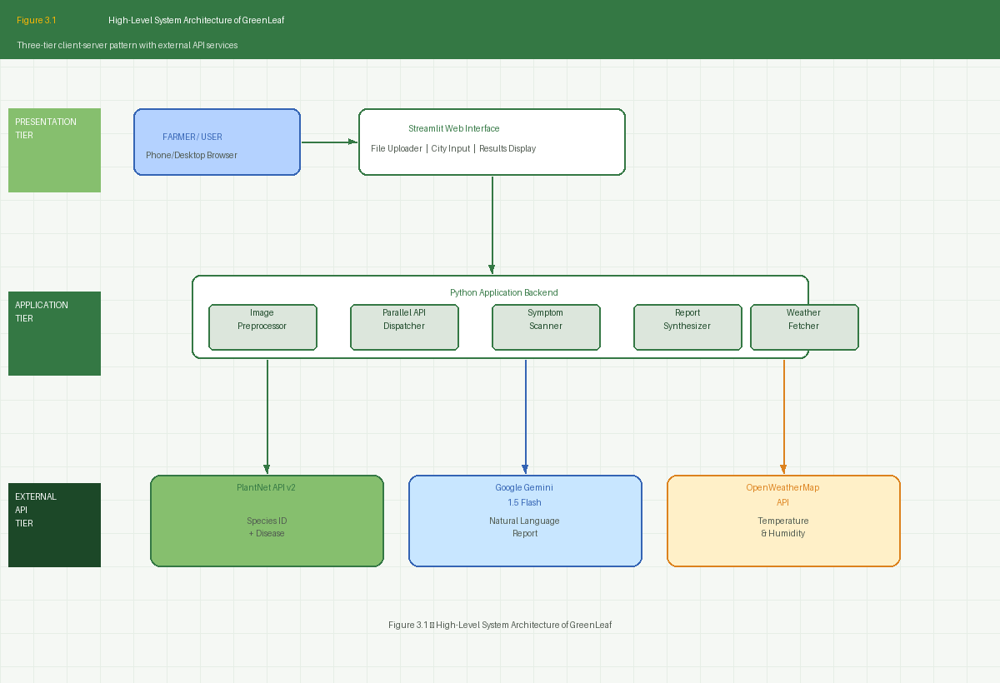

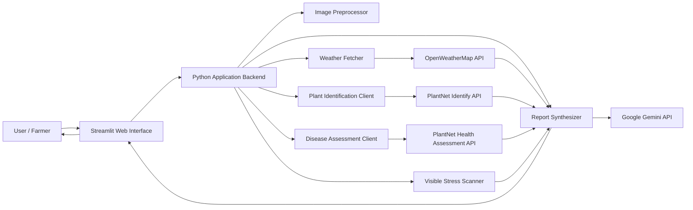

## 12. Component Explanation

### 12.1 Streamlit Interface

The interface is defined in `app.py`. It includes:

- Page configuration with title, icon, and wide layout.
- Custom CSS for a green-themed dashboard.
- Sidebar with usage instructions, tips, and developer links.
- Main two-column layout:
  - Left column: file upload, city input, image preview, weather badges.
  - Right column: quick check, analyze button, result cards, full AI report.

### 12.2 Secret Management

Function: `get_secret(name)`

This function first attempts to load a key from Streamlit secrets. If not found, it reads from environment variables loaded by `python-dotenv`.

### 12.3 Weather Fetching

Function: `get_weather(city)`

The function calls OpenWeatherMap and returns:

- Temperature in Celsius.
- Humidity percentage.

It is cached with `st.cache_data(ttl=600)`, so repeated city queries within 10 minutes avoid unnecessary API calls.

### 12.4 Image Preprocessing

Function: `prepare_image_bytes(uploaded_file)`

This function:

- Reads the uploaded file.
- Opens it with Pillow.
- Handles invalid image errors.
- Uses the first frame for animated images.
- Converts the image to RGB.
- Re-encodes it as clean JPEG bytes.

This makes the image safer and more consistent for external API calls.

### 12.5 PlantNet API Communication

Function: `call_plantnet(endpoint, image_bytes, organs="leaf")`

This function sends the uploaded leaf image to PlantNet using multipart form data. It retries requests up to three times and raises meaningful errors if the API response fails.

PlantNet endpoints used:

- `identify/all`
- `health_assessment`

### 12.6 Plant Identification

Function: `identify_plant(image_bytes)`

This function returns:

- Scientific name.
- Common name.
- Confidence score.
- Raw API result.

### 12.7 Disease Identification

Function: `identify_disease(image_bytes)`

This function returns:

- Disease or issue name.
- Confidence score.
- Raw API result.

Disease results are shown as a detected disease only when confidence is at least `0.30`.

### 12.8 Visible Leaf Stress Detection

Function: `detect_visible_leaf_stress(image)`

This is a fallback heuristic scanner. It resizes the image and counts:

- Green-like pixels.
- Lesion-like pixels.

It estimates a lesion ratio and maps it into:

- Low severity.
- Moderate severity.
- High severity.
- Unknown severity.

This is not a full ML classifier, but it helps when API disease detection is unavailable or uncertain.

### 12.9 Fallback Report

Function: `build_fallback_report(...)`

This function creates a report when Gemini is unavailable or fails. It includes plant result, disease result, weather context, visible symptoms, and uncertainty note.

### 12.10 Gemini Report Generation

Function: `analyze_leaf_with_context(...)`

This function builds a prompt using:

- Plant identification result.
- Disease identification result.
- Visible symptom scan.
- City.
- Temperature.
- Humidity.

It asks Gemini to generate sections for plant identification, disease status, confidence, likely cause, treatment, and weather-aware prevention tips.

## 13. Use Case Diagram

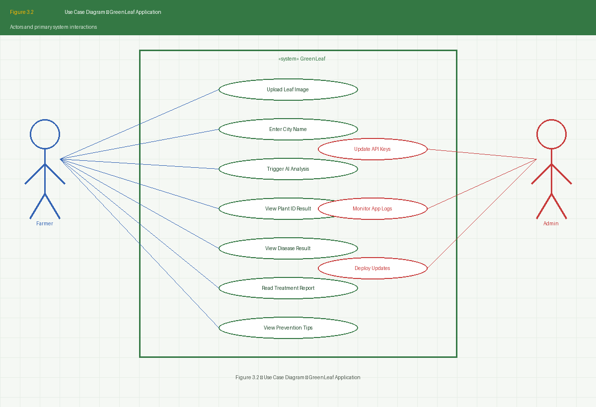

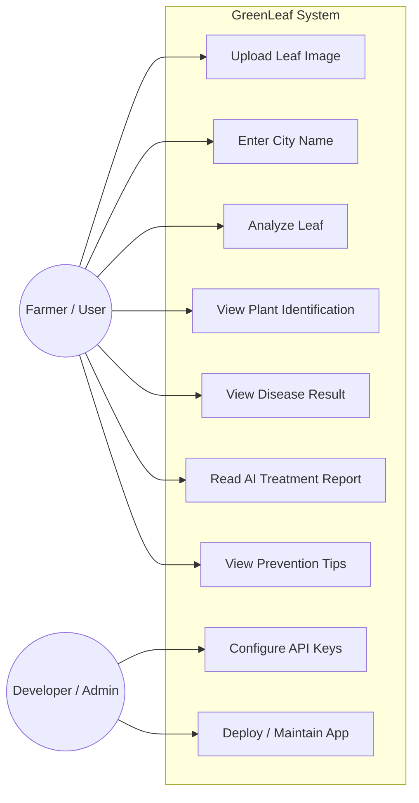

## 14. Data Flow Diagrams

### 14.1 DFD Level 0 - Context Diagram

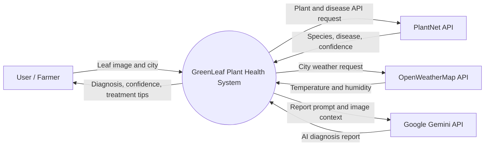

### 14.2 DFD Level 1 - Processing Pipeline

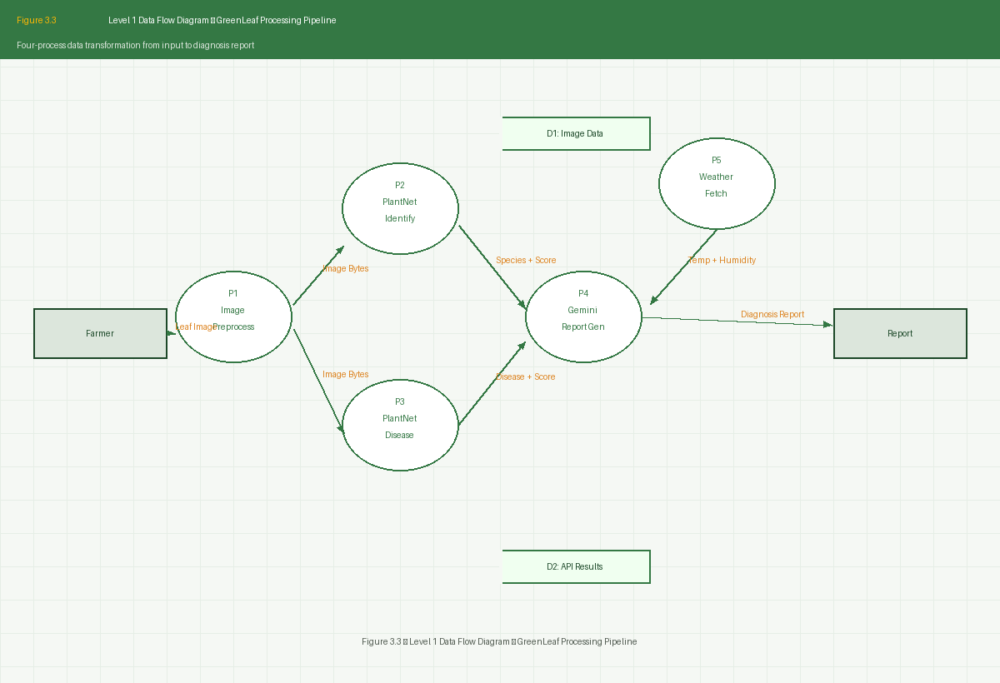

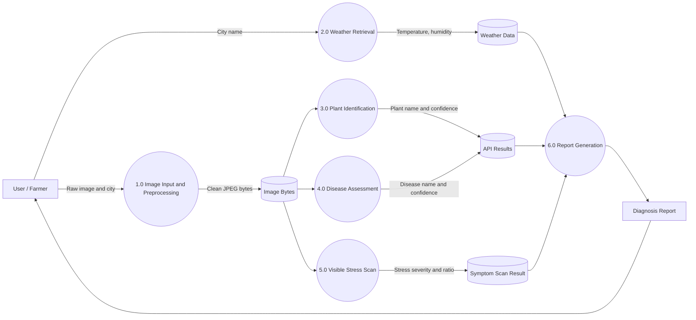

### 14.3 DFD Level 2 - Analyze Leaf Process

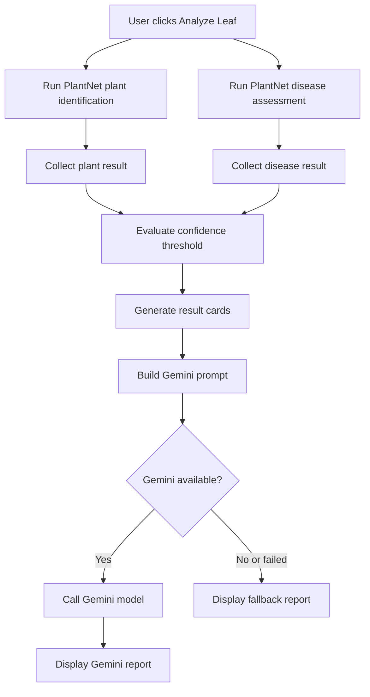

## 15. Sequence Diagram

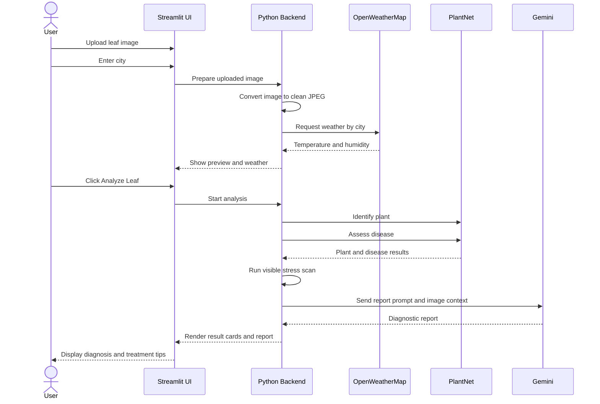

## 16. Activity Diagram

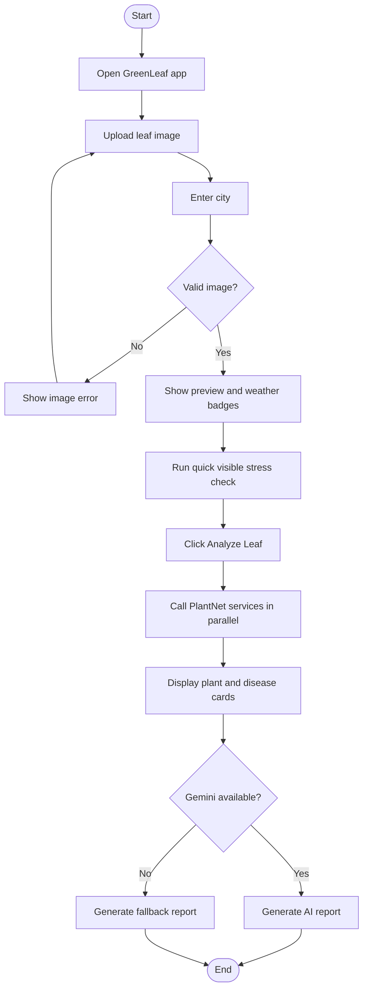

## 17. Class / Module Diagram

```mermaid
classDiagram
    class app_py {
        +get_secret(name)
        +get_weather(city)
        +prepare_image_bytes(uploaded_file)
        +call_plantnet(endpoint, image_bytes, organs)
        +identify_plant(image_bytes)
        +identify_disease(image_bytes)
        +safe_identify_plant(image_bytes)
        +safe_identify_disease(image_bytes)
        +detect_visible_leaf_stress(image)
        +build_fallback_report(...)
        +get_gemini_model()
        +analyze_leaf_with_context(...)
    }

    class logic_py {
        +refine_prediction(disease, confidence, temp, humidity)
    }

    class weather_utils_py {
        +get_weather(city, api_key)
    }

    app_py --> "PlantNet API" : requests
    app_py --> "OpenWeatherMap API" : requests
    app_py --> "Google Gemini" : report generation
    app_py --> "Pillow" : image processing
    logic_py --> app_py : optional legacy helper
    weather_utils_py --> app_py : optional legacy helper
```

## 18. Entity Relationship Diagram

The current implementation does not use a database. The following ERD represents logical data entities handled during one analysis session.

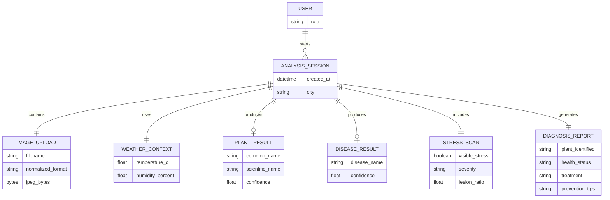

## 19. Deployment Diagram

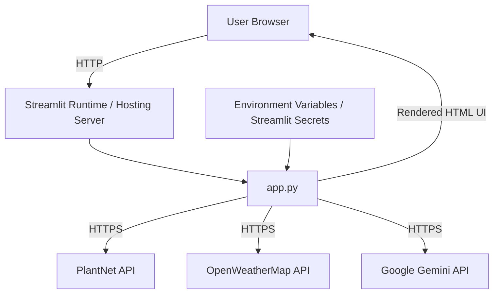

## 20. UI Screens and Existing Figures

The project already contains generated image figures that can be used in reports or presentations.

### 20.1 Homepage / Hero

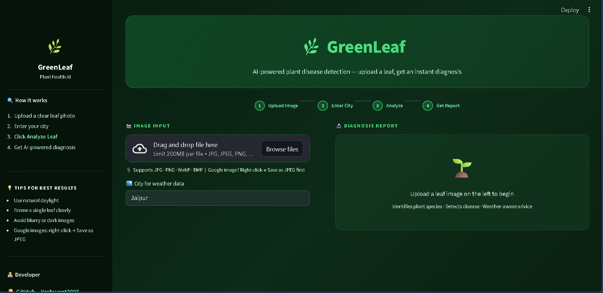

### 20.2 Upload Panel and Weather

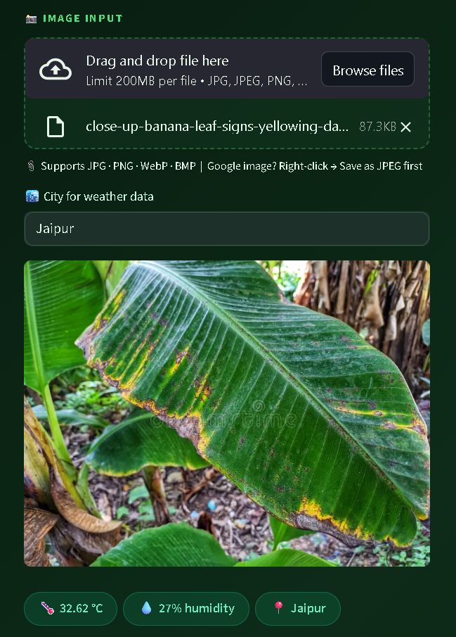

### 20.3 Quick Visual Check

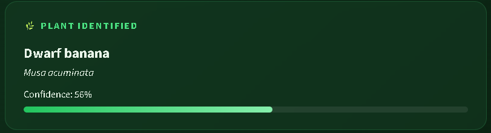

## 21. Important Functions in Detail

### `prepare_image_bytes(uploaded_file)`

This is one of the most important reliability functions. Uploaded images from phones, browsers, or Google image downloads may contain unusual encodings, transparency, metadata, or animation frames. The function normalizes the file by converting it into RGB JPEG bytes. This improves compatibility with PlantNet and Gemini.

### `call_plantnet(endpoint, image_bytes, organs="leaf")`

PlantNet expects multipart form data with image files and organ labels. The function uses a list of tuples for both `files` and `data`, which preserves repeated field names correctly. It retries failed network calls and exposes short API error text for debugging.

### `detect_visible_leaf_stress(image)`

The quick stress scanner is a rule-based heuristic. It examines pixel colors and estimates the ratio of lesion-like pixels to total relevant pixels. It helps the app avoid saying "healthy" too quickly when external disease identification is uncertain.

### `analyze_leaf_with_context(...)`

This function combines all available signals into a prompt for Gemini. It asks for six sections:

1. Plant identified.
2. Likely disease or health status.
3. Confidence and uncertainty note.
4. Likely cause.
5. Treatment in simple English.
6. Prevention tips based on current weather.

## 22. Error Handling

| Failure Case | Handling |
| --- | --- |
| Missing weather API key | Returns default weather values. |
| Invalid image file | Shows a user-facing error and asks for valid JPEG/PNG-style image. |
| PlantNet request failure | Shows a friendly service-unavailable message. |
| Disease API error | Shows the API error text for easier debugging. |
| Gemini unavailable | Uses fallback report. |
| Low disease confidence | Shows uncertainty instead of overclaiming disease certainty. |

## 23. Security Considerations

- API keys should remain in `.env` or Streamlit secrets.
- `.env` should not be committed to public repositories.
- Uploaded images are processed in memory and not stored by the current app.
- External API calls send user-uploaded leaf images to third-party services.
- The application should mention privacy expectations if deployed publicly.

## 24. Limitations

- Diagnosis depends on external API availability.
- Weather city lookup may fail for misspelled or ambiguous city names.
- Visible stress detection is color-rule based and not a medical-grade disease classifier.
- PlantNet and Gemini confidence can vary based on image quality.
- The local `plant_model.h5` file is present but not integrated into the current `app.py`.
- No persistent storage exists for analysis history.
- No admin dashboard exists beyond developer-maintained configuration.

## 25. Future Enhancements

- Integrate `plant_model.h5` as a local fallback classifier.
- Add report export as PDF.
- Add user login and saved report history.
- Add database storage for diagnosis sessions.
- Add location auto-detection.
- Add crop-specific treatment recommendations.
- Add multilingual report generation.
- Add expert review mode for agriculture officers.
- Add confidence calibration and model comparison.
- Add image quality scoring before diagnosis.

## 26. Testing Checklist

| Test Case | Expected Result |
| --- | --- |
| Upload valid JPG image | Image preview appears. |
| Upload WebP image | Image is converted and previewed. |
| Upload invalid file | Error message appears. |
| Enter valid city | Weather badges show temperature and humidity. |
| Missing weather key | Default weather values are used. |
| Click Analyze with valid keys | Plant and disease analysis completes. |
| PlantNet down | App shows service error instead of crashing. |
| Gemini key missing | Fallback report appears. |
| Low disease confidence | App displays uncertainty message. |
| Mobile viewport | Layout stacks into one column. |

## 27. Conclusion

GreenLeaf is a practical AI-assisted plant health diagnosis application built with Python and Streamlit. It combines image preprocessing, PlantNet identification, weather context, visible-stress heuristics, and Gemini-powered report writing to provide helpful plant-care guidance. The design is lightweight, easy to run, and suitable for final year project demonstration, while still leaving clear paths for future improvements such as local model integration, persistent storage, and PDF report generation.

